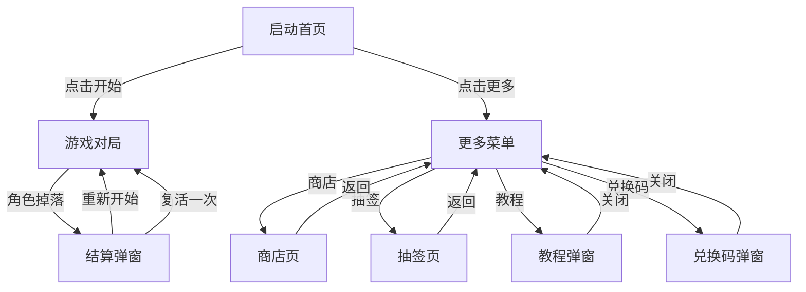

# 《跳跃吧螃蟹先生！》产品需求文档

## 1. 产品概述
一款可直接在手机浏览器运行的单文件竖屏休闲跳一跳网页小游戏，玩家操控拟人化文具角色在错落的方块平台上前行跳跃。整体采用马卡龙简约治愈画风，主色调为低饱和浅紫色，所有数据通过 localStorage 本地永久存储，无需后端、无需联网、无需安装。

## 2. 核心功能

### 2.1 用户角色
本游戏为单机休闲游戏，无注册/登录系统；玩家身份单一，所有数据归属本机浏览器。

### 2.2 功能模块
1. **启动首页（home）**：游戏标题、角色立绘、开始按钮、更多入口
2. **更多功能菜单页（menu）**：商店、抽签、教程、兑换码 四大入口
3. **商店与皮肤穿戴页（shop）**：角色皮肤切换、穿戴、解锁，金币消耗
4. **抽签抽奖页（lottery）**：100 金币单抽，奖励包含金币、限定皮肤
5. **游戏对局界面（play）**：蓄力跳跃、得分、金币实时累加
6. **游戏结算弹窗（gameover）**：本局得分、历史最高、重新开始、复活
7. **辅助弹窗（tutorial / redeem）**：教程说明、兑换码输入与发放

### 2.3 页面详情
| 页面名称 | 模块名称 | 功能描述 |
|---------|---------|---------|
| 启动首页 | 标题区 | 顶部白色粗体大字"跳跃吧" + 副标题"螃蟹先生！" |
| 启动首页 | 角色区 | 左下角拟人化圆规角色立绘（带粗眉毛、红腮红、笑脸）站立在灰色方块上 |
| 启动首页 | 入口区 | 中央白色大圆角按钮（绿色箭头 + "点击开始"），底部"更多 >"文字链接 |
| 更多菜单页 | 入口区 | 上方 2×1 网格：商店、抽签；下方 2×1 列表：教程、兑换码；左上角圆形返回按钮 |
| 商店页 | 展示区 | 中央角色立绘 + 左右切换箭头；右上角金币显示 |
| 商店页 | 皮肤条 | 底部横向滑动预览条，展示已解锁/未解锁皮肤缩略图 |
| 商店页 | 操作区 | 底部大圆角按钮：未穿戴显示"使用"、已穿戴显示"使用中"、未解锁显示价格 |
| 抽签页 | 展示区 | 中央像素风白发角色 + 拟人美工刀立绘，右侧金色"燔阳灵签"竖排文字 + 金币点缀 |
| 抽签页 | 操作区 | 底部金色圆角按钮"抽签:100金币"，点击播放抽奖动画并弹结果 |
| 游戏对局 | 得分 | 顶部居中两位数字本局得分（00、01、02…） |
| 游戏对局 | 蓄力条 | 屏幕底部横向进度条，长按时填充，松手立即重置 |
| 游戏对局 | 角色 | 拟人化文具角色，随跳跃抛物线移动并旋转，落地有反弹/震动反馈 |
| 游戏对局 | 平台 | 灰色等轴测立体方块持续向前生成，间距/尺寸随机 |
| 结算弹窗 | 标题 | 顶部"真棒！" |
| 结算弹窗 | 数据 | 左栏"历史最高"+分数；右栏"本次得分"+分数；下方金币图标 + 总金币数 |
| 结算弹窗 | 操作 | 重新开始（免费重置）/ 复活一次（100 金币保留分数） |
| 辅助弹窗 | 教程 | 文字说明"长按屏幕蓄力、松开手指跳跃" |
| 辅助弹窗 | 兑换码 | 输入框 + 确认按钮，输入正确兑换码发放金币或皮肤 |

## 3. 核心流程

### 玩法主循环
1. 玩家在游戏对局长按屏幕任意位置开始蓄力
2. 屏幕底部蓄力条随按压时长增长，上限不再增长
3. 松开手指，角色沿抛物线跳出，蓄力条清零
4. 角色落在前方方块顶面 → 站稳 → 等待下次蓄力
5. 落在空白区域 → 触发结算弹窗
6. 每次成功落地：按方块类型 +1/+3/+5 分，连续连击每跳 +2；同时发放等额金币

## 4. 用户界面设计

### 4.1 设计风格
- **主色调**：低饱和淡紫色背景（#E8E3F5 → #D8CFE8 渐变）
- **强调色**：深蓝色（#2C3E8F）用于图标/文字；绿色（#3DBE6F）用于行动箭头/反馈图标；金色（#F4C25C）用于金币/抽奖
- **按钮**：大圆角（border-radius 24~32px），柔和浅阴影（0 4px 16px rgba(80,60,140,.12)）
- **字体**：圆润粗体中文（"Noto Sans SC", "PingFang SC", "Microsoft YaHei", system-ui, sans-serif），标题加粗
- **布局**：以卡片为基本单位，留白充足，圆角柔和
- **图标**：简约深蓝色线性风格（用 SVG inline 实现）

### 4.2 页面设计概览
| 页面名称 | 模块名称 | UI 元素 |
|---------|---------|---------|
| 启动首页 | 标题 | 白色 56pt 粗体 "跳跃吧" + 36pt "螃蟹先生！"，居中 |
| 启动首页 | 角色 | 左下角 SVG 拟人圆规，眉毛粗、红腮红、笑脸，灰色等轴测方块底座 |
| 启动首页 | 开始按钮 | 白色 56pt 高 88pt 圆角胶囊，绿色右箭头 + 黑色"点击开始" |
| 启动首页 | 更多 | 底部居中"更多 >"灰色文字按钮 |
| 更多菜单 | 标题 | 顶部居中"更多" |
| 更多菜单 | 返回 | 左上 48×48 深蓝圆，左向白箭头 |
| 更多菜单 | 商店卡 | 上左白色方卡，星球图标 + "商店" |
| 更多菜单 | 抽签卡 | 上右白色方卡，书签图标 + "抽签" |
| 更多菜单 | 教程卡 | 下左长条，书本图标 + "教程" |
| 更多菜单 | 兑换码卡 | 下右长条，礼物盒图标 + "兑换码" |
| 商店页 | 顶部 | 标题=当前皮肤名；右上金币图标+数字 |
| 商店页 | 中央 | 角色立绘 + 左右白色三角切换按钮 |
| 商店页 | 预览条 | 底部横向滚动列表，皮肤缩略图 |
| 商店页 | 操作按钮 | 大圆角按钮，三态文案（使用中/使用/价格） |
| 抽签页 | 中央 | 像素白发角色 + 美工刀立绘 + 金色"燔阳灵签"竖排 + 金币点缀 |
| 抽签页 | 按钮 | 金色圆角"抽签:100金币" |
| 游戏对局 | 背景 | 纯色淡紫色 (#EFEAF7) |
| 游戏对局 | 得分 | 顶部居中两位数字（等宽粗体） |
| 游戏对局 | 蓄力条 | 底部固定 80% 宽 16pt 高圆角，渐变填充 |
| 结算弹窗 | 卡片 | 深灰圆角 (#3A3550) 居中 |
| 结算弹窗 | 按钮 | 白色圆角，左侧绿图标 + 黑字 |

### 4.3 响应式适配
- 优先手机竖屏（360×640 ~ 414×896）
- 横屏时游戏区域保持竖屏比例（9:16），两侧用背景色自适应填充
- 所有尺寸使用 vh / vw / rem 弹性单位 + dvh 处理移动浏览器地址栏
- 触屏事件统一使用 touchstart / touchend，并阻止默认滚动
- 关键点击区域 ≥ 44×44pt，无溢出变形

### 4.4 视觉资源
- 角色立绘、方块、金币、UI 图标全部使用内嵌 SVG / Canvas 绘制，不依赖外部图片
- 字体使用系统字体回退（Noto Sans SC / PingFang SC）
- 所有页面切换使用 200ms 淡入淡出动画
