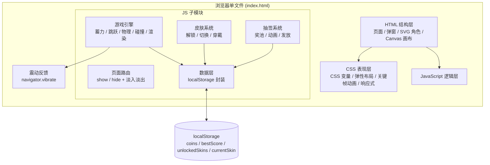
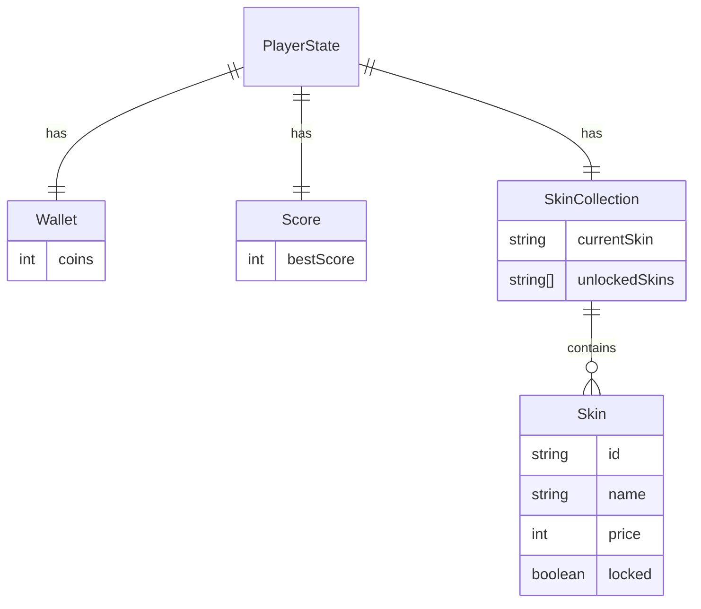

# 《跳跃吧螃蟹先生！》技术架构文档

## 1. 架构设计



## 2. 技术描述

- **前端**：原生 HTML5 + CSS3 + Vanilla JavaScript（ES2017+）
- **渲染**：HTML/CSS 负责 UI 布局与样式；Canvas 2D 负责游戏对局的方块生成、角色物理与动画
- **数据存储**：浏览器 `localStorage`，4 个核心键
  - `jbc.coins` — 玩家总金币（number）
  - `jbc.bestScore` — 历史最高分（number）
  - `jbc.unlockedSkins` — 已解锁皮肤列表（JSON array of ids）
  - `jbc.currentSkin` — 当前穿戴皮肤 id（string）
- **后端**：无
- **数据库**：无
- **依赖**：零外部依赖；不引用任何 CDN / JS 库 / 字体文件；全部自包含
- **打包**：单文件 `index.html`（HTML + 内嵌 CSS + 内嵌 JS），双击即可在手机/电脑浏览器中运行

## 3. 路由定义

采用 hash-less 单页路由（基于显示/隐藏 + 淡入淡出）：

| 视图 ID | 用途 |
|---------|------|
| `view-home` | 启动首页 |
| `view-menu` | 更多功能菜单 |
| `view-shop` | 商店与皮肤穿戴 |
| `view-lottery` | 抽签页 |
| `view-play` | 游戏对局 |
| `modal-gameover` | 结算弹窗（覆盖于 play 之上） |
| `modal-tutorial` | 教程弹窗（覆盖于 menu 之上） |
| `modal-redeem` | 兑换码弹窗（覆盖于 menu 之上） |
| `modal-result` | 抽签结果弹窗 |

## 4. API 定义

无后端 API。仅暴露内部 JS 模块接口：

```ts
// 数据层
Storage.getCoins(): number
Storage.setCoins(n: number): void
Storage.getBestScore(): number
Storage.setBestScore(n: number): void
Storage.getUnlockedSkins(): string[]
Storage.unlockSkin(id: string): void
Storage.getCurrentSkin(): string
Storage.setCurrentSkin(id: string): void

// 皮肤
Shop.skins: { id, name, price, draw(ctx, x, y, w) }[]
Shop.current: Skin
Shop.preview(index: number): void
Shop.equip(): void
Shop.unlock(id: string): boolean

// 抽签
Lottery.cost: 100
Lottery.roll(): { type: 'coins' | 'skin', value }

// 游戏引擎
Game.start(): void
Game.jump(power: number): void
Game.end(reason: 'fall' | 'revive'): void
Game.onScore(cb: (score, coinGain) => void): void
Game.onLanding(cb: (blockType, distance, combo) => void): void
```

## 5. 服务端架构

无服务端。所有逻辑运行在浏览器单文件内。

## 6. 数据模型

### 6.1 数据模型定义



### 6.2 数据定义语言（localStorage DDL）

```js
// 初始默认值（首次运行时写入）
const DEFAULT_STATE = {
  coins: 0,
  bestScore: 0,
  unlockedSkins: ['compass'],         // 初始自带「圆规叔叔」
  currentSkin: 'compass',
};

// 兑换码表（内置常量，可扩展）
const REDEEM_CODES = {
  'WELCOME100':   { type: 'coins', value: 200 },
  'CRAB888':      { type: 'coins', value: 888 },
  'GIVEMEPAPA':   { type: 'skin',  value: 'pawn' }, // 示例：可兑换「象棋-兵」
  'FANYANG':      { type: 'coins', value: 500 },
};

// 抽签奖池
const LOTTERY_POOL = [
  { type: 'coins', value: 50,  weight: 40 },
  { type: 'coins', value: 100, weight: 30 },
  { type: 'coins', value: 200, weight: 15 },
  { type: 'coins', value: 500, weight: 5 },
  { type: 'skin',  value: 'pawn', weight: 10 },
];
```

### 6.3 皮肤目录

| id | 名称 | 解锁方式 | 默认解锁 |
|----|------|---------|---------|
| `compass` | 圆规叔叔 | 初始自带 | ✅ |
| `pawn` | 象棋-兵 | 商店 200 金币 / 兑换码 / 抽签 | ❌ |
| `?` | 预留拓展位 | — | ❌ |

### 6.4 计分与金币规则

| 方块类型 | 宽度特征 | 距离特征 | 分数 | 金币 |
|---------|---------|---------|------|------|
| 普通基础方块 | 中等 | 中等 | +1 | +1 |
| 小型窄方块 | 较窄 | 中等 | +3 | +3 |
| 大间距远距离 | 中等 | 较远 | +5 | +5 |
| 连击加成 | — | — | 每跳 +2 | +2 |

> 总得分 = Σ(单跳基础分) + 2×(成功跳跃次数 - 1) （从第 2 跳起算）
> 总金币累加 = Σ(每跳得分)

## 7. 物理与渲染参数

- **画布**：自动铺满游戏区域，纵向滚动；视角随角色向前推进（角色 x 维持在屏幕 30% 位置）
- **方块生成**：每隔 80~220 像素前向生成 1 个，宽度 50~120 像素，高度 30~60 像素，y 随机偏移 ±20
- **蓄力曲线**：按压时长 0~1.4s 线性映射到 0~1 力度；超过 1.4s 维持最大值
- **跳跃物理**：水平初速度 = power × 12，竖直初速度 = -power × 18 - 8，重力 g = 0.9/帧
- **旋转**：跳跃期间角速度随 power（0.08 ~ 0.18 rad/帧），落地时复位
- **碰撞**：角色脚部（character.y + character.h）方块顶面 y，且水平投影在方块 [x, x+w] 内 → 成功；否则掉落
- **震动反馈**：`navigator.vibrate(20)` 在每次成功落地时触发

## 8. 性能与兼容

- 目标设备：iOS Safari 14+ / Android Chrome 90+ / 微信内置 / 平板
- 渲染：Canvas 2D + requestAnimationFrame，目标稳定 60fps
- 资源：纯矢量 / 程序生成，0 网络请求
- 触屏：`touchstart` / `touchend` 监听屏幕任意位置；阻止默认 `e.preventDefault()` 防止页面滚动
- 横屏适配：`@media (orientation: landscape)` 容器宽度锁定为 `min(100vw, calc(100vh * 9/16))` 居中，两侧填充背景色
- 单位策略：使用 `dvh` 替代 `vh` 适配移动浏览器地址栏
